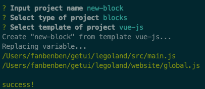

# 贡献

> 将系统中复用性较高的组件进行抽离、复用，利于提高开发效率以及产品的统一性。

## 开发组件

### 启动 Legoland

```
git clone legoland_repo_url
npm install
npm run serve
```


### 新增组件

```bash
npm run add
```

填入组件名称，选择组件类型，选择组件模板，Legoland 会自动创建组件，目录位于 `/src` 中对应的组件类型文件夹下，例如：`/src/blocks/my-block`



### 编写文档

legoland 使用 README.md 文件编写组件文档，支持在 `.md` 文件中编写 Vue 组件进行组件示例的展示：

<el-button type="primary" @click="alert">{{text}}</el-button>
```html
<template>
  <el-button type="primary" @click="alert">{{text}}</el-button>
</template>
<script>
export default {
  data () {
    return {
      text: 'Legoland'
    }
  },
  methods: {
    alert () {
      this.$alert('Hello Legoland')
    }
  }
}
</script>
```


## 添加组件初始化模板

在 `/templates` 下新建初始模板目录，模板文件中可使用变量：

| 变量           | 释义     |
| -------------- | -------- |
| `{{LIB_NAME}}` | 组件名   |
| `{{LIB_TYPE}}` | 组件类型 |